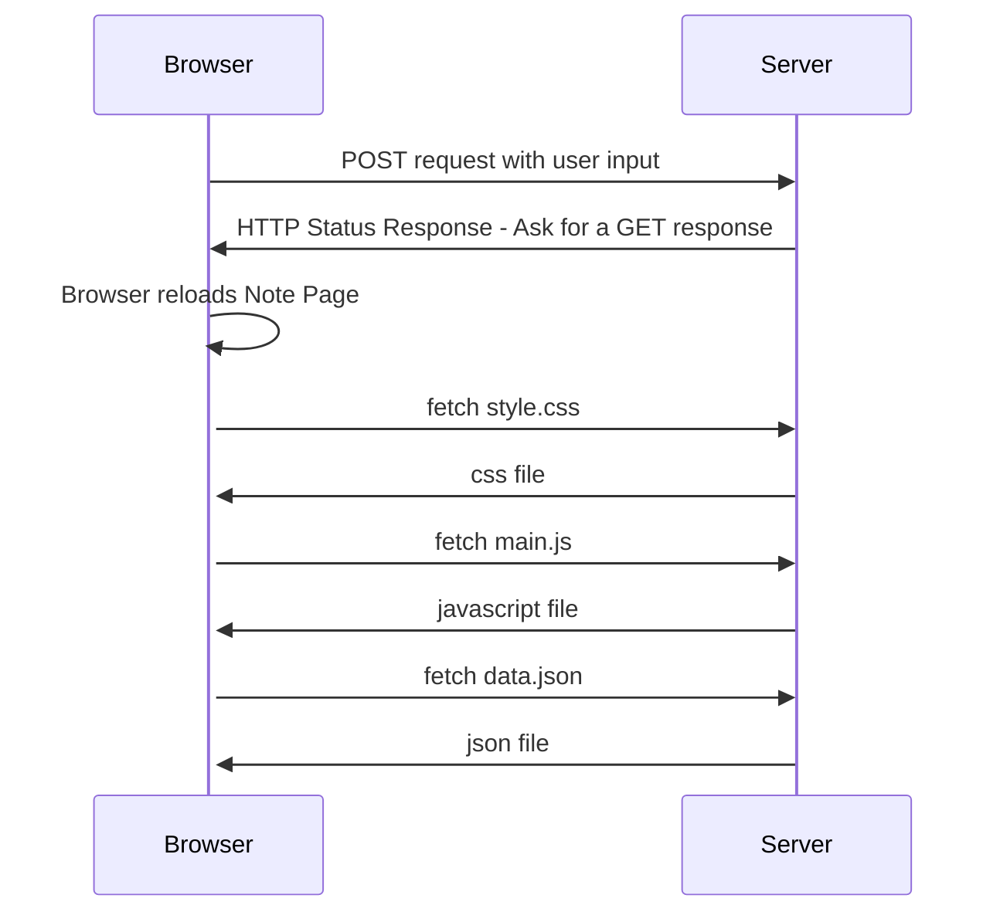

```mermaid
sequenceDiagram
    Browser->>Server: POST request with user input;
    Server->>Browser: HTTP Status Response - Ask for a GET response;
    Browser->>+Browser: Browser reloads Note Page;
    Browser->>Server: fetch style.css;
    Server->>Browser: css file;
    Browser->>Server: fetch main.js;
    Server->>Browser: javascript file;
    Browser->>Server: fetch data.json;
    Server->>Browser: json file;
```
